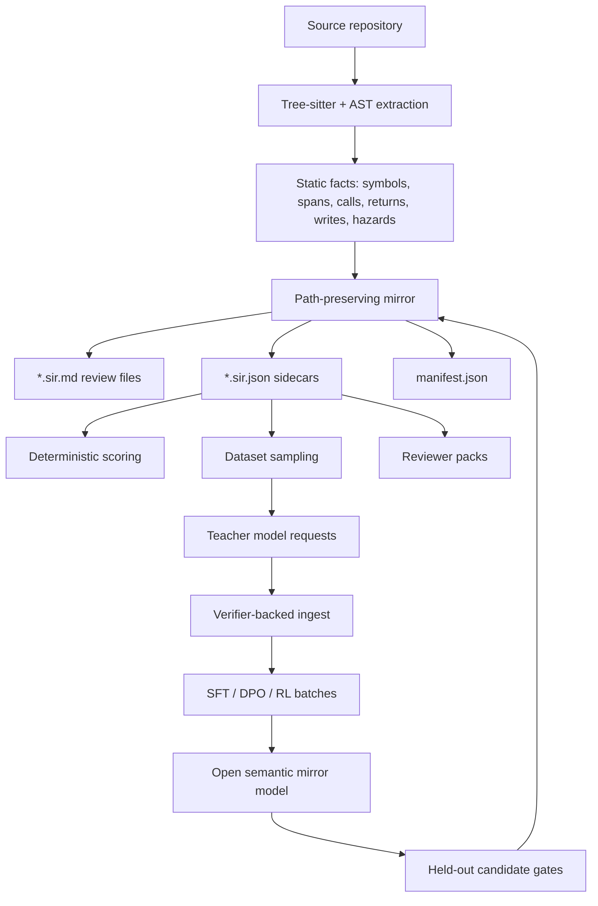
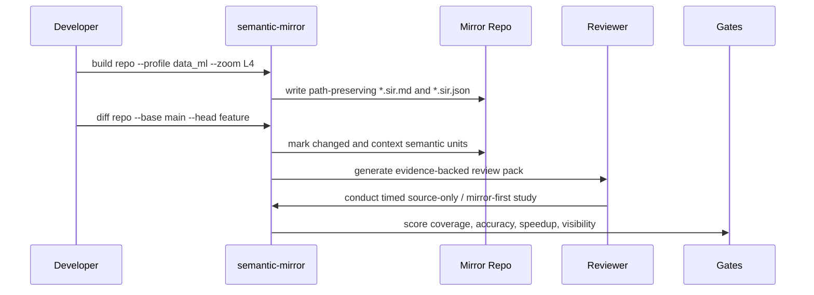
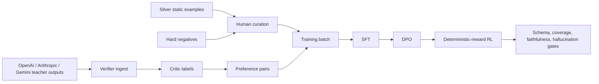

# Semantic Mirror

Semantic Mirror turns a source repository into a path-preserving semantic mirror:
reviewable Markdown plus machine-readable JSON sidecars that describe what the
code does, with source-line evidence for every claim.

The core idea is simple: code review and model training both need something
better than a prose summary. Semantic Mirror preserves behavior, side effects,
control flow, data dependencies, failure modes, and Data/ML mechanics in a
structured representation that can be inspected by humans and scored by
deterministic validators.

This repository is a CLI-first research prototype for building, evaluating, and
training those semantic mirrors.

## Why This Exists

Large models are useful at explaining code, but ungrounded explanations are hard
to trust. Semantic Mirror treats explanations as artifacts that must prove where
they came from.

The goal is a system that can:

- generate a mirror repo beside the source repo, preserving paths and symbols
- make every generated claim cite concrete source spans
- show uncertainty instead of silently inventing missing behavior
- produce diff mirrors that highlight changed behavior in a PR
- build datasets from verified mirrors, hard negatives, teacher models, and
  focused human review
- train an open model to emit faithful semantic IR for code review workflows

The first domain is Python Data/ML code: training loops, model definitions,
losses, metrics, dataloaders, optimizers, checkpoint logic, tensor/device
behavior, and experiment configuration.

## What A Mirror Looks Like

Source code:

```python
def train_epoch(model, loader, optimizer, loss_fn):
    model.train()
    total_loss = 0.0
    for batch in loader:
        optimizer.zero_grad()
        logits = model(batch["x"])
        loss = loss_fn(logits, batch["y"])
        loss.backward()
        optimizer.step()
        total_loss += loss.item()
    return total_loss / len(loader)
```

Semantic Mirror output is not a paragraph like "this trains a model." It is a
structured representation with evidence and review-facing detail:

```json
{
  "unit_id": "train_epoch",
  "symbol_type": "function",
  "source_spans": [{"path": "train.py", "start_line": 1, "end_line": 11}],
  "control_flow": ["iterates over loader batches"],
  "calls": ["model.train", "optimizer.zero_grad", "model", "loss_fn", "loss.backward", "optimizer.step", "loss.item", "len"],
  "returns": ["average loss across loader batches"],
  "state_mutations": ["sets model to training mode", "updates optimizer parameters"],
  "data_ml_details": {
    "losses": ["loss_fn(logits, batch[\"y\"])"],
    "training_loops": ["one optimizer update per batch"],
    "optimizer_scheduler_behavior": ["zero_grad before backward, step after backward"],
    "metrics": ["accumulates loss.item()"],
    "tensor_shapes": [],
    "checkpointing": []
  },
  "uncertainty": []
}
```

The real generated files include richer metadata, static facts, source evidence,
confidence, schema validation, and Markdown rendering for human review.

## Architecture



## Review And Diff Flow



## Training Loop



The durable asset is not a single hosted model. It is the schema, verifier,
dataset workflow, reward suite, curation loop, and trained open-model path.

## Quick Start

Install with `uv` from the repo root:

```powershell
uv sync
uv run pytest
```

Build a semantic mirror for a Python repository:

```powershell
uv run semantic-mirror build <repo> --out <mirror_repo> --profile data_ml --zoom L4
```

Score the mirror against the source:

```powershell
uv run semantic-mirror score <mirror_repo> --repo <repo>
```

Generate a semantic diff for a PR or commit range:

```powershell
uv run semantic-mirror diff <repo> --base <ref> --head <ref> --out <mirror_repo>/diffs/<id>
```

Create reviewer-facing questions from a mirror:

```powershell
uv run semantic-mirror review pack <mirror_repo> --out <review_pack_dir>
uv run semantic-mirror review study <review_pack_dir> --out <human_study_dir>
uv run semantic-mirror review study-collection-plan --study whole_repo=<human_study_dir> --study diff_mode=<diff_human_study_dir> --answers-dir <phase6_dir> --reviewer <name> --out <phase6_plan.json>
uv run semantic-mirror review conduct-study <human_study_dir> --out <answers.jsonl> --reviewer <name>
uv run semantic-mirror review study-status <human_study_dir> --answers <answers.jsonl> --out <coverage.json>
uv run semantic-mirror eval human-study <human_study_dir> --answers <answers.jsonl> --out <report.json>
uv run semantic-mirror eval human-study-suite --report <whole_repo_report.json> --report <diff_mode_report.json> --out <phase6_summary.json>
```

## Command Map

### Mirror Generation

```powershell
uv run semantic-mirror build <repo> --out <mirror_repo> --profile data_ml --zoom L4
uv run semantic-mirror diff <repo> --base <ref> --head <ref> --out <mirror_repo>/diffs/<id>
uv run semantic-mirror score <mirror_repo> --repo <repo>
```

### Corpus And Dataset Creation

```powershell
uv run semantic-mirror corpus collect --repo <repo_or_git_url> --repo <repo_or_git_url> --out <corpus_dir> --max-units-per-repo 100
uv run semantic-mirror dataset sample <repo> --out <dataset_dir> --max-units 200 --review-budget 50
uv run semantic-mirror dataset promote-gold <dataset_dir> --record-id <silver_or_review_record_id> --label verified_behavior --reviewer <name>
```

### Evaluation

```powershell
uv run semantic-mirror eval mirror <mirror_repo> --repo <repo> --out <report.json>
uv run semantic-mirror eval dataset <dataset_dir> --out <report.json>
uv run semantic-mirror eval compare <baseline_report.json> <current_report.json>
uv run semantic-mirror eval candidates <dataset_dir> --candidates <model_outputs.jsonl> --model-name <run_name> --out <report.json>
uv run semantic-mirror eval model-compare <baseline_eval.json> <current_eval.json> --stage sft
uv run semantic-mirror eval review-pack <review_pack_dir> --mirror <mirror_repo> --out <report.json>
```

### Review Studies

```powershell
uv run semantic-mirror review pack <mirror_repo> --out <review_pack_dir>
uv run semantic-mirror review study <review_pack_dir> --out <human_study_dir>
uv run semantic-mirror review study-collection-plan --study whole_repo=<human_study_dir> --study diff_mode=<diff_human_study_dir> --answers-dir <phase6_dir> --reviewer <name> --out <phase6_plan.json>
uv run semantic-mirror review conduct-study <human_study_dir> --out <answers.jsonl> --reviewer <name>
uv run semantic-mirror review study-status <human_study_dir> --answers <answers.jsonl> --out <coverage.json>
uv run semantic-mirror eval human-study <human_study_dir> --answers <answers.jsonl> --out <report.json>
uv run semantic-mirror eval human-study-suite --report <whole_repo_report.json> --report <diff_mode_report.json> --out <phase6_summary.json>
```

`review study-collection-plan` writes a reproducible Phase 6 command plan for
one or more labeled study directories, including resumable `conduct-study`,
coverage, per-study eval, and suite commands. `review study-status` checks
Phase 6 answer collection before scoring human usefulness. It reports pending
task ids, unknown or duplicate answer ids, paired source/mirror coverage, real
timed answer records, reviewer identity, source/mirror answer text, and
visibility acknowledgements. It exits nonzero until the answer log is complete
enough to evaluate.

`eval human-study` prints and writes `phase6_gate_summary`, including real
timed reviewer-log provenance, reviewer identity, source/mirror answer text,
paired answer coverage, mirror-first accuracy threshold, mirror accuracy versus
source-only, median speedup, changed-behavior accuracy, and visibility
acknowledgement gates. Answer records must include `reviewer`, `started_at`,
`completed_at`, positive `elapsed_seconds`, and nonempty source/mirror
`answer` text before Phase 6 can pass.
`eval human-study-suite` combines completed whole-repo and diff-mode
`eval human-study` reports into one Phase 6 summary and fails unless both
required task sets are present, all reports pass, and the aggregate real-timed,
accuracy, speed, changed-behavior, and visibility gates pass.

### Teacher And Critic Pipeline

```powershell
uv run semantic-mirror teacher export <dataset_dir> --out <teacher_requests_dir>
uv run semantic-mirror teacher run --requests <candidate_requests.jsonl> --out <responses.jsonl> --max-requests 5
uv run semantic-mirror teacher run --provider anthropic --model claude-sonnet-4-5-20250929 --requests <candidate_requests.jsonl> --out <responses.jsonl> --max-requests 5
uv run semantic-mirror teacher run --provider gemini --model gemini-2.5-flash --requests <candidate_requests.jsonl> --out <responses.jsonl> --max-requests 5
uv run semantic-mirror teacher ingest <dataset_dir> --requests <candidate_requests.jsonl> --responses <responses.jsonl> --out <teacher_results_dir>
uv run semantic-mirror teacher run-critic --requests <teacher_results_dir>/critic_requests.jsonl --out <critic_responses.jsonl> --max-requests 5
uv run semantic-mirror teacher ingest-critic <teacher_results_dir> --responses <critic_responses.jsonl> --out <teacher_results_dir>
uv run semantic-mirror teacher pipeline <dataset_dir> --out <teacher_pipeline_dir> --provider openai --provider anthropic --provider gemini --max-units 5
```

### Training

```powershell
uv run semantic-mirror train prepare <dataset_dir> --out <training_dir>
uv run semantic-mirror train prepare <dataset_dir> --teacher-results <teacher_pipeline_dir> --out <training_dir>
uv run semantic-mirror train validate <training_dir> --out <training_dir>/validation_report.json
uv run semantic-mirror train audit <training_dir> --env-file .env
uv run semantic-mirror train audit <training_dir> --python-executable C:\path\to\python.exe --env-file .env
uv run semantic-mirror train package <training_dir> --out <training_bundle_dir> --env-file .env
uv run semantic-mirror train run-sft <training_dir> --output-dir <sft_model_dir> --max-steps 300 --dry-run
uv run semantic-mirror train run-dpo <training_dir> --model-name-or-path <sft_model_dir> --output-dir <dpo_model_dir> --max-steps 120 --dry-run
uv run semantic-mirror train run-rl <training_dir> --model-name-or-path <dpo_model_dir> --output-dir <rl_model_dir> --max-steps 120 --dry-run
uv run semantic-mirror train report <run_outputs_dir> --out <run_outputs_dir>/diagnostics
uv run semantic-mirror train contract-status <run_outputs_dir> --sft-steps 300 --dpo-steps 120 --rl-steps 120 --repo-root . --windows-audit <windows_audit.json> --wsl-smoke-manifest <smoke_chain_manifest.json> --package-source-freshness <source_freshness.json> --human-study-coverage <coverage.json> --human-study-suite <phase6_summary.json> --out <run_outputs_dir>/contract_status.json --markdown-out <run_outputs_dir>/contract_status.md
uv run semantic-mirror train inspect-samples <dataset_dir> --raw-candidates <raw.jsonl> --repaired-candidates <repaired.jsonl> --out <samples_dir> --model-name <run_name>
```

Packaged GPU bundles also include `launch/run_full_training_eval.sh`, which
runs SFT, DPO, RL, held-out raw/repaired candidate generation, per-stage sample
inspection, diagnostics, SFT-vs-baseline comparison, DPO-vs-SFT comparison, and
RL-vs-SFT comparison. It writes `outputs/validation_report.json` and
`outputs/audit.json` before training, then includes both in
`outputs/training_eval_summary.json`. The package `launch/commands.json` also
lists standalone validate, audit, inspect-samples, and report commands for
manual operator runs, plus contract-status, repaired, and raw model-compare commands for
SFT/DPO/RL. Raw candidate eval reports and raw SFT/DPO/RL comparison reports
are saved even when raw output does not pass schema gates, so repair is not
hidden; `training_eval_summary.json` marks raw comparisons as diagnostic
non-blocking, reports required/diagnostic gate counts, and includes a per-stage
`raw_gate_summary` with raw parseability, schema validity, repair-free contract
counts/rates, raw stretch-gate pass flags, raw eval metrics, and raw comparison
deltas. The same summary includes `final_eval_gate_summary`, a compact rollup of
held-out coverage, repaired schema validity, repaired model-compare gates,
RL-vs-SFT raw non-regression, and raw stretch gate status. The launcher also
writes `outputs/contract_status.json` and `outputs/contract_status.md`, which
list any missing stage manifests, eval reports, sample inspections,
diagnostics, or final gates. Generated prompts include
an explicit compact final SIR JSON object prefilled with source-backed static
facts between `FINAL_SIR_JSON_START` and `FINAL_SIR_JSON_END`, and instruct the
model to return that object as the final JSON. The
generated SFT/RL/candidate scripts use the tokenizer chat template when
available and disable Qwen thinking during candidate generation. The RL script
also rewards raw completions for preserving populated source-backed fields
before repair, while penalizing extra report-style keys and over-expanded fact
lists. The reward reference now carries the compact target unit and expected
list counts, so RL can penalize identity drift, extra top-level keys, long
completions, and compact-count overruns before deterministic repair.

Longer full-eval runs can be restarted deliberately. Set
`REUSE_STAGE_OUTPUTS=1` to reuse an existing SFT/DPO/RL output directory only
when its `training_stage_manifest.json` `max_steps` matches the requested stage
cap; set
`SFT_RESUME_FROM_CHECKPOINT=<checkpoint_dir>` or
`DPO_RESUME_FROM_CHECKPOINT=<checkpoint_dir>` to resume those trainer-backed
stages from a checkpoint. The trainer-backed stages default to
`SFT_SAVE_STEPS=10`, `DPO_SAVE_STEPS=10`, `SFT_SAVE_TOTAL_LIMIT=3`, and
`DPO_SAVE_TOTAL_LIMIT=3` so interrupted bounded runs keep recent checkpoints
without retaining every checkpoint. RL currently records `resume_supported=false`,
so the wrapper only reuses completed RL output.
Generation prompts explicitly require the answer to start with `{"unit_id"`,
preserve identity fields exactly, and forbid template or marker wrappers.
Candidate and RL generation also use a balanced-JSON stop criterion so decoding
can stop after the first complete object instead of running to the token cap.
Generated RL and candidate commands default to
`--schema-prefix-mode schema-scaffold`, which prefixes exact identity fields and
a complete required-key SIR skeleton before the model continues the JSON object.
This is the default constrained raw-output diagnostic because the current smoke
failure mode is parseable JSON with missing required top-level keys. Set
`SCHEMA_PREFIX_MODE=off` (or pass `--schema-prefix-mode off`) to measure
unconstrained free-form completions; use `identity-algorithm` to reproduce the
weaker identity-plus-algorithm prefix.
Candidate generation also supports `--generation-mode field-wise`, exposed in
packages as `GENERATION_MODE=field-wise`. That mode asks the model for
individual source-backed field fragments and assembles them into a raw SIR unit,
recording per-field parse, empty-output, token, and cap-hit metadata as
`field_generation_reports`. It defaults to `--field-target-mode compact`, which
uses the compact target as the field upper bound; use
`FIELD_TARGET_MODE=static-facts` (or `--field-target-mode static-facts`) when
measuring full source-backed static-fact coverage. `FIELD_TARGET_LIMIT=<n>` can
bound large static-fact fields during that diagnostic to reduce cap hits and
over-generation. `FIELD_TARGET_MODE=static-hints` is a bounded middle path: it
keeps compact JSON item shapes, adds compacted static-fact hints, and defaults
to conservative per-field hint budgets that preserve parseability. Set
`FIELD_TARGET_LIMIT=<n>` to override those budgets explicitly, and set
`FIELD_TARGET_MAX_CHUNKS=<n>` to cover larger fields in multiple small hint
chunks while keeping each fragment parseable. Use
`FIELD_TARGET_CHUNK_FIELDS=calls,writes,...` to restrict chunking to selected
fields when broader chunking improves coverage but increases hallucinations.
This can measure whether
parseable field-wise generation can preserve more source-backed facts without
feeding the model the full verbose static-facts record.
`FIELD_OBJECT_PREFIX_MODE=object` is available as an opt-in
fragment-shape diagnostic; it defaults to `off` because prefixing can make weak
models emit empty fragments. Field-wise mode is a constrained field-generation
diagnostic, not deterministic repair.

Generated candidate export now defaults deterministic faithfulness repair to
`--faithfulness-repair-mode schema-only`, exposed in packages as
`FAITHFULNESS_REPAIR_MODE=schema-only`. This keeps repaired candidates from
adding semantic claims while still normalizing identity and required schema
shape. Use `FAITHFULNESS_REPAIR_MODE=compact-target` to copy the compact target
claims, or `FAITHFULNESS_REPAIR_MODE=full-static` only for explicit diagnostics
that need to reproduce the old full static-facts repair.
Sample manifests report raw generation cap hits, parse errors, repair-free
contract counts, exact identity counts, top-level key validity, and compact
shape validity so raw-output failures stay visible apart from repaired schema
validity.

For the required bounded smoke gate, packaged bundles include
`launch/run_smoke_chain.sh`:

```bash
HELD_OUT_DATASET=<dataset_dir> SFT_SMOKE_STEPS=1 DPO_SMOKE_STEPS=1 RL_SMOKE_STEPS=1 SMOKE_SCHEMA_PREFIX_MODE=schema-scaffold SMOKE_GENERATION_MODE=full-json bash launch/run_smoke_chain.sh
```

The smoke chain validates and audits the batch, runs capped SFT/DPO/RL stages,
generates raw and repaired candidates for each stage, writes sample inspection
artifacts, produces diagnostics, and records `outputs/smoke-chain/smoke_chain_manifest.json`.
The smoke manifest includes per-stage sample rollups for raw parseability, raw
schema validity, repair-free contract counts, repaired schema validity, and
stage/sample artifact existence checks, with rates and gate flags for raw
parseability, raw schema validity, raw repair-free contract validity, and
repaired schema validity.

Use `train report` after smoke or full runs to produce
`diagnostics/training_summary.json`, `diagnostics/training_summary.md`, and PNG
plots for SFT, DPO, RL, generation, eval, and schema/coverage metrics. Use
`train contract-status` on a full-eval `outputs` directory to list which target
stage manifests, eval reports, sample inspections, diagnostics, and final gates
are proven or still missing; pass `--markdown-out` for a reviewer-readable
summary. The status report includes a contract scorecard, per-stage evidence
table, reward summary from the contract's maximum-point table, grouped
remaining gates, resume-inspection decisions when present, and next-action
commands for resume, diagnostics regeneration, and status refresh. Unknown or
unproven required areas earn zero reward points, so a run-output-only status
does not claim repo hygiene or Windows readiness. Pass `--repo-root` to include
`git status --short --branch --ignored` evidence; tracked edits, untracked
paths, or unexpected ignored files keep repo hygiene at zero while allowed
local-only ignored paths such as `.env`, `.semantic-mirror/`, `.venv/`,
`SEMANTIC_MIRROR_PLAN.md`, `SEMANTIC_MIRROR_GOAL_CONTRACT.md`, and `outputs/`
are classified separately. Pass
`--windows-audit` and `--wsl-smoke-manifest` to score Windows/Unsloth readiness:
a Windows-native audit can pass directly, or a documented native blocker can
pass when paired with complete Windows-hosted WSL smoke-chain evidence for
SFT/DPO/RL stage manifests, sample manifests, and diagnostics. Pass
`--package-source-freshness` with a source freshness JSON report to prove the
packaged `src/semantic_mirror` runtime source matches the repo commit used for
status evidence. Pass
`--human-study-coverage` with one or more `review study-status` reports to
surface answer-collection readiness, and `--human-study-suite` with an
`eval human-study-suite` report to score the optional Phase 6 usefulness area;
every real-timed reviewer, accuracy, speed, changed-behavior, visibility, and
task-set gate must pass before those points are earned. It treats DPO/RL evals,
samples, and diagnostics as stale unless the corresponding stage manifest
matches the requested target cap; diagnostics must also cite source files from
the current `outputs` directory. Use
`train inspect-samples` after generation to
keep raw parseability, raw schema validity, raw generation cap hits, raw
repair-free contract validity, repaired schema validity, and repaired
faithfulness evidence separate.

## Output Files

| File | Purpose |
| --- | --- |
| `*.sir.md` | Human-readable semantic IR beside a path-preserving source structure. |
| `*.sir.json` | Schema-valid sidecars for training, validation, scoring, and reward computation. |
| `manifest.json` | Repo-level inventory, symbol graph, verifier metadata, confidence, coverage, and optional diff metadata. |
| `silver.jsonl` | Automatically sampled positive examples. |
| `hard_negative.jsonl` | Deterministic contrastive examples with known defects. |
| `review_queue.jsonl` | High-impact or high-disagreement examples for human curation. |
| `gold.jsonl` | Human-promoted examples with labels, reviewer metadata, and notes. |
| `teacher_candidates.jsonl` | Eval-ready teacher model candidates after verifier ingest. |
| `preference_pairs.jsonl` | DPO/RL preference data from hard negatives, critic labels, and teacher outputs. |
| `human_study/` | Source-only, mirror-first, and visibility tasks for usefulness evaluation. |

## Semantic Zoom Levels

| Level | Intended Use | Detail Budget |
| --- | --- | --- |
| `L1` | Repo and module orientation | Intent, major flows, high-level responsibilities. |
| `L2` | Everyday review | Function/class behavior, calls, returns, side effects. |
| `L3` | Behavioral review | Branch predicates, data dependencies, mutation order. |
| `L4` | Data/ML and safety-sensitive review | Implementation details, training mechanics, hazards, uncertainty. |

## Verifiable Rewards

Semantic Mirror is built around measurable faithfulness rather than subjective
"good explanations."

| Reward Area | Positive Signal | Penalty |
| --- | --- | --- |
| Static faithfulness | Preserved calls, returns, writes, state mutations, failure modes. | Invented calls, writes, errors, behavior, or unsupported evidence. |
| Control flow | Preserved branches and guard ordering. | Collapsed predicates when the zoom level requires exact behavior. |
| Data/ML detail | Preserved losses, optimizer behavior, metrics, checkpoints, tensor/device assumptions. | Missing training mechanics or hallucinated model behavior. |
| Review usefulness | Faster accurate mirror-first answers and changed-behavior detection. | Hidden uncertainty or unsupported areas presented as facts. |

Release gates are meant to be concrete:

- at least 90% parsed function/class coverage or an explicit unsupported reason
- 100% generated claims with source-span evidence
- zero verifier-detected invented side effects on gold examples
- diff changed-unit recall of at least 95% on curated PRs
- no more than 1% score regression between accepted releases
- SFT/RL candidates must preserve schema validity, held-out unit coverage,
  static faithfulness, and hallucination penalties against baselines

## Current Implementation Scope

Implemented locally:

- Python AST extraction with Tree-sitter parser metadata.
- Path-preserving whole-repo mirror generation.
- Git ref diff mode over changed files.
- Evidence validation for generated claims.
- Data/ML detectors for losses, model components, training loops, optimizers,
  schedulers, metrics, checkpoints, tensor/device operations, and hazards.
- Deterministic reward scoring for calls, returns, writes, state mutations,
  failure modes, invented facts, and invalid evidence.
- Dataset sampling with silver records, hard negatives, review queues, and gold
  promotion.
- Multi-repository corpus collection for aggregate training batches.
- Reviewer packs for whole-repo and diff-mode review.
- Human usefulness study generation, interactive answer collection, and
  evaluator gates.
- Provider-neutral teacher request export, response ingest, critic execution,
  and critic-label ingest.
- Optional OpenAI, Anthropic, and Gemini teacher execution paths.
- Training preparation for SFT, contrastive repair, preference pairs, and RL
  prompts.
- Runtime audit, dry-run launch gates, and portable Linux/WSL/Colab training
  bundle packaging.

## Training Status

The training path currently targets a Qwen3-family local-fit LoRA configuration
through generated Unsloth/TRL scripts. The current repo can prepare, validate,
package, and dry-run launch commands on Windows, but actual GPU training expects
a Linux or WSL CUDA environment with Python `>=3.11,<3.14` and the training
dependencies installed.

Known local artifact status from the development run:

- compact SFT and repaired RL candidate gates pass for the guarded model
  pipeline
- longer compact SFT, DPO, and deterministic-reward RL runs completed in WSL
- repaired SFT and RL candidate evaluations pass held-out coverage and schema
  validity gates
- raw model completions are not yet a pure contract: deterministic repair still
  fills required schema and source-backed static facts after generation
- human-study artifacts exist, but real timed reviewer logs are still needed
  before claiming human usefulness gates

## Repository Layout

```text
src/semantic_mirror/
  builder.py       mirror generation orchestration
  cli.py           command-line interface
  corpus.py        multi-repository corpus collection
  dataset.py       silver, hard-negative, review-queue, and gold datasets
  evaluation.py    mirror, dataset, candidate, and regression gates
  extractors.py    static extraction and Data/ML detectors
  gitdiff.py       changed-file and changed-unit diff support
  render.py        Markdown rendering
  review.py        review packs and human-study tasks
  rewards.py       deterministic scoring
  schema.py        semantic IR schema validation
  teacher.py       provider-neutral teacher and critic pipeline
  training.py      training batch, audit, package, and launch helpers
tests/
  test_semantic_mirror.py
```

## Example Goal

A strong end-to-end use case should look like this:

1. A developer opens a PR that changes a training loop.
2. `semantic-mirror diff` identifies the changed semantic units, not just the
   changed lines.
3. The mirror shows that the PR moved `optimizer.zero_grad()` after
   `loss.backward()`, marks the training-loop hazard, and cites the exact source
   lines.
4. The reviewer answers behavior questions from the mirror faster than from
   source-only review.
5. The generated IR is accepted into a gold or silver dataset.
6. Future SFT/DPO/RL training improves on that case without losing source-span
   evidence or inventing behavior.

That is the product target: a faithful semantic representation that is useful
for review, measurable enough for regression gates, and structured enough to
train an open model.

## Environment Notes

- Normal CLI development and validation works on Windows with `uv`.
- GPU training is expected to run in Linux or WSL CUDA, not native Windows
  Python 3.14.
- `.env` is used for provider keys during teacher and critic runs. It is not
  copied into packaged training bundles.
- Training artifacts under local output directories are generated artifacts and
  should not be treated as source.

## Project Maturity

This is an active research prototype. The core CLI and guarded pipeline are in
place, but the final research claims still depend on two remaining gates:

- pure raw-output model quality without deterministic repair as a required
  post-processing step
- real timed human-study logs showing mirror-first review usefulness

Until those gates are satisfied, the honest claim is: Semantic Mirror is a
working evidence-backed semantic IR pipeline with training and evaluation
machinery, not a finished model product.
